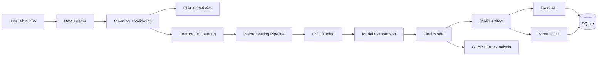

# Intelligent Customer Churn Prediction & ML Decision System

End-to-end Data Science + Machine Learning Engineering system for customer churn analysis, prediction, explainability, error analysis, API inference, and a Streamlit decision-support UI.

## Dataset
This project uses the public IBM Telco Customer Churn sample dataset. IBM describes it as a fictional telecommunications company churn dataset, with `Churn` indicating whether a customer left within the last month. The IBM GitHub archive contains the CSV used by this project.

- IBM documentation: https://www.ibm.com/docs/en/cognos-analytics/12.0.x?topic=samples-telco-customer-churn
- IBM source repository: https://github.com/IBM/telco-customer-churn-on-icp4d
- Runtime raw CSV: `https://raw.githubusercontent.com/IBM/telco-customer-churn-on-icp4d/master/data/Telco-Customer-Churn.csv`

The source dataset has 7,043 customer rows and 21 raw columns. The project does not fabricate model metrics: metrics are produced by the training pipeline and written to `experiments/results.csv`.

## What it demonstrates
- Reproducible data loading and data-quality reporting
- Leakage-safe preprocessing with scikit-learn pipelines
- EDA and statistical testing
- Customer-behavior feature engineering
- Feature selection analysis
- Class-imbalance comparison
- Logistic Regression, Random Forest, HistGradientBoosting
- Stratified cross-validation and controlled hyperparameter tuning
- Accuracy, precision, recall, F1, ROC-AUC, PR-AUC, confusion matrix and curves
- SHAP global/local explanations when SHAP is installed
- False-positive / false-negative error analysis
- Versioned model artifacts and metadata
- Flask REST API + Gunicorn
- Streamlit decision-support application
- SQLite prediction history
- pytest coverage of core components and API/database behavior
- Responsible-ML documentation

## Architecture


## Technology stack
Python, pandas, NumPy, SciPy, scikit-learn, Matplotlib, Seaborn, SHAP, Flask, SQLite, joblib, pytest, Streamlit, Gunicorn.

## Installation
```bash
python -m venv .venv
# Windows: .venv\Scripts\activate
# Linux/macOS: source .venv/bin/activate
pip install -r requirements.txt
```

Copy `.env.example` to `.env` if local configuration is required.

## Reproducible workflow
```bash
python -m src.data.loader
python -m src.analysis.eda
python -m src.analysis.statistics
python -m src.models.train
python -m src.models.evaluate
python -m src.models.tune
python -m src.explainability.shap_explainer
pytest -q
```

The loader downloads the IBM CSV into `data/raw/` if it is absent. For offline use, place the source CSV there manually.

## Run API
```bash
gunicorn --bind 0.0.0.0:8000 'src.api.app:create_app()'
```
Windows development fallback:
```bash
python -m src.api.app
```

## Run Streamlit
```bash
streamlit run streamlit_app/app.py
```

## API endpoints
- `GET /health`
- `POST /predict`
- `GET /model-info`
- `POST /explain`
- `GET /analytics`

Example request:
```json
{
  "customer_id": "7590-VHVEG",
  "gender": "Female",
  "SeniorCitizen": 0,
  "Partner": "Yes",
  "Dependents": "No",
  "tenure": 1,
  "PhoneService": "No",
  "MultipleLines": "No phone service",
  "InternetService": "DSL",
  "OnlineSecurity": "No",
  "OnlineBackup": "Yes",
  "DeviceProtection": "No",
  "TechSupport": "No",
  "StreamingTV": "No",
  "StreamingMovies": "No",
  "Contract": "Month-to-month",
  "PaperlessBilling": "Yes",
  "PaymentMethod": "Electronic check",
  "MonthlyCharges": 29.85,
  "TotalCharges": 29.85
}
```

## UI design
The Streamlit interface intentionally uses a strict monochromatic palette: **white, cream, ivory, gold, and dark brown text**. No blue/green/purple/red dashboard colors are used. Risk levels are communicated through neutral gold/cream treatments rather than traffic-light colors.

## Limitations
The source is a fictional telco sample, not production customer data. Historical associations are not causal evidence. Model probabilities are not guarantees. SHAP explanations describe model behavior, not causal effects. Thresholds are configurable and should be validated against the business cost of false positives and false negatives.

## Future improvements
- Probability calibration and calibration curves
- Time-based validation if longitudinal data becomes available
- Model registry/version promotion workflow
- Authentication and authorization for production API use
- Drift monitoring and scheduled retraining
- Cost-sensitive threshold optimization using validated business costs
