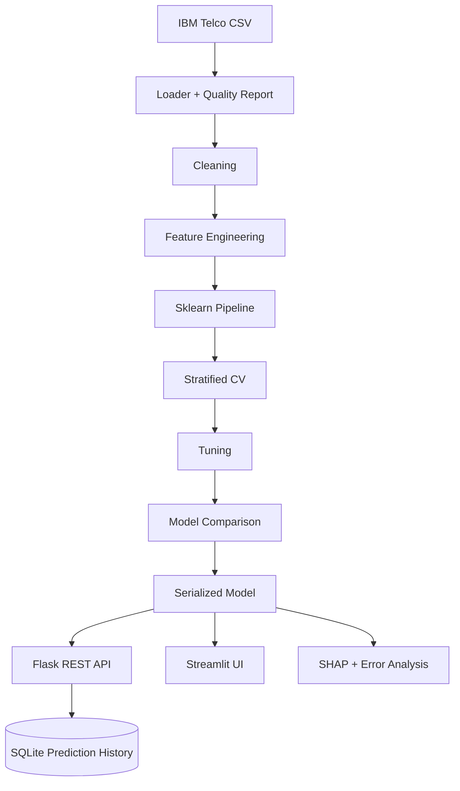

# Architecture

```mermaid
flowchart TD
A[IBM Telco CSV]-->B[Loader + Quality Report]-->C[Cleaning]-->D[Feature Engineering]-->E[Sklearn Pipeline]
E-->F[Stratified CV]-->G[Tuning]-->H[Model Comparison]-->I[Serialized Model]
I-->J[Flask REST API]-->K[(SQLite Prediction History)]
I-->L[Streamlit UI]
I-->M[SHAP + Error Analysis]
```
